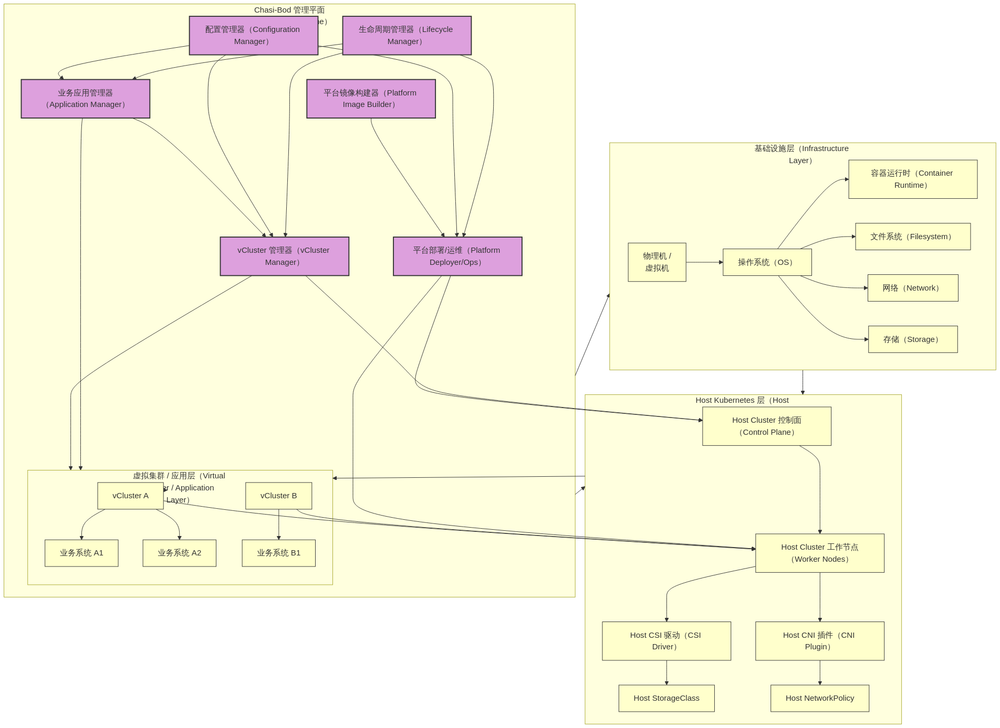
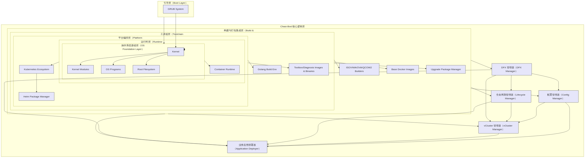
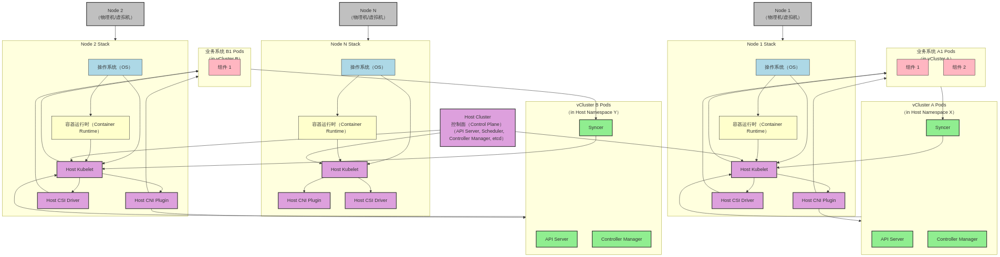

# Chasi-Bod 总体架构设计

## 1. 引言

在现代微服务和云原生架构下，企业通常需要部署和管理多个复杂且相互独立的业务系统。将这些业务系统部署在独立的物理或虚拟机集群上会导致资源分散、成本高昂、管理复杂。部署在同一个大型 Kubernetes 集群的命名空间中虽然节省资源，但在多租户场景下，命名空间提供的隔离性（尤其在控制面层面）往往不足，且难以满足各业务系统对特定 Kubernetes 组件、API 版本或自定义资源的需求。

`chasi-bod` 项目应运而生，旨在提供一个优雅的解决方案，通过融合 `sealer` 的“集群即镜像”理念和 `vcluster` 的虚拟化 Kubernetes 集群技术，构建一个支持多业务系统融合部署在共享基础设施上的平台。它不仅提供了强大的隔离性，还通过统一的构建、打包、分发和运行机制，极大地简化了平台和业务系统的全生命周期管理。

`chasi-bod` 的核心价值在于：
* **高效融合:** 将多个业务系统部署在同一共享 Kubernetes 集群之上，提高资源利用率。
* **严格隔离:** 利用 `vcluster` 技术为每个业务系统或业务组提供独立的虚拟 Kubernetes 控制面和数据面（Pod 隔离），实现比命名空间更强的隔离性。
* **极致简化:** 借鉴 `sealer` 的理念，将底层操作系统、Kubernetes 集群、`vcluster` 基础配置以及公共服务打包成一个可分发的镜像，极大地简化了平台的部署和运维。
* **标准化接入:** 提供统一的业务系统接入规范和配置模板，降低业务系统上平台的改造和适配成本。

## 2. 核心概念与目标

### 2.1 核心概念

* **Chasi-Bod 平台镜像:** 这是一个集成了底层操作系统、容器运行时、共享 Kubernetes（Host Cluster）、`vcluster` 部署组件、网络存储驱动、基础工具链等的整体镜像（类似 `sealer` 的 ClusterImage）。它是 `chasi-bod` 平台的基础，通过它可以快速部署或升级整个共享基础设施。
* **Host Cluster:** 指的是物理机或虚拟机上部署的、运行 `chasi-bod` 平台镜像带来的底层 Kubernetes 集群。它负责调度和管理 `vcluster` 的 Pod 以及其他平台级服务。
* **vCluster (Virtual Cluster):** 运行在 Host Cluster 的一个或多个命名空间中的虚拟 Kubernetes 集群。每个 `vcluster` 拥有自己的 API Server、Controller Manager、Scheduler 等控制面组件，并管理其内部的应用 Pod。不同 `vcluster` 之间的控制面是隔离的，通过 `vcluster` 同步器将虚拟集群的资源（如 Pod）同步到 Host Cluster 执行。
* **业务系统应用:** 部署在 `vcluster` 内部的实际业务应用，它们感知的是虚拟集群的环境，极少需要关心底层 Host Cluster 的细节。
* **Chasi-Bod 管理平面:** 负责 `chasi-bod` 平台镜像的构建、分发，Host Cluster 的部署、扩缩容、升级，`vcluster` 的创建、管理、配置注入，以及业务系统应用的统一编排和监控。

### 2.2 项目目标

* 构建一个可打包、可分发的 `chasi-bod` 平台镜像。
* 实现通过 `chasi-bod` 平台镜像快速部署 Host Cluster 的能力。
* 提供基于模板的 `vcluster` 创建和管理接口。
* 定义业务系统在 `vcluster` 内的标准部署规范。
* 实现统一的网络、存储、系统参数配置管理。
* 建立明确的平台与业务系统边界。
* 支持平台及业务系统的生命周期管理（部署、升级、扩缩容、备份恢复）。
* 提供统一的监控、日志、诊断工具集。

## 3. 总体架构 (High-Level Architecture)

`chasi-bod` 平台的总体架构可以分为三个主要层面：基础设施层、Host Kubernetes 层和虚拟集群/应用层。`chasi-bod` 本身作为一个管理平面，贯穿并协调这三个层面。

**图 3-1 Chasi-Bod 总体架构图**

* **基础设施层:** 提供基础的计算、存储、网络资源，并安装操作系统和容器运行时。这是 `chasi-bod` 平台镜像的基础部分。
* **Host Kubernetes 层:** 在基础设施层之上部署的共享 Kubernetes 集群，由 `chasi-bod` 平台镜像提供和管理。它提供了调度 Pod、管理网络和存储的底层能力。
* **虚拟集群 / 应用层:** 在 Host Cluster 之上，通过 `vcluster` 技术创建的隔离环境。每个 `vcluster` 内部署一个或多个业务系统的应用。
* **Chasi-Bod 管理平面:** `chasi-bod` 项目本身的核心逻辑所在，负责整个平台的构建、部署、配置、管理和运维。它通过与 Host Cluster 和 `vcluster` 交互来管理整个系统。

## 4. 分层设计与核心组件

`chasi-bod` 的内部结构遵循严格的分层设计，这与 `sealer` 的镜像构建概念相契合。每一层都建立在其下层之上，提供特定的功能。

**图 4-1 Chasi-Bod 内部层级架构图**

各层说明：

* **引导层 (Boot Layer):** 包含 GRUB 或其他引导加载程序，负责启动系统。
* **操作系统基础层 (OS Foundation Layer):** 包含 Linux Kernel、必要的内核模块、基础 OS 程序集和根文件系统骨架。这是构建一切的基础。
* **运行时层 (Runtime Layer):** 包含容器运行时（如 containerd 或 Docker）。Kubernetes 依赖此层来运行容器。
* **平台编排层 (Platform Orchestration Layer):** 包含 Host Kubernetes 集群的核心组件及其依赖（如 etcd、网络插件 CNI、存储插件 CSI）以及 Helm 等包管理器。此层由 `chasi-bod` 负责安装和配置。
* **工具链层 (Toolchain Layer):** 包含用于开发、诊断和维护平台的工具，例如 Golang 构建环境（如果需要在运行时编译某些工具）、各种诊断命令、监控 Agent 等。
* **构建与打包集成层 (Build & Package Integration Layer):** 包含生成 `chasi-bod` 平台镜像所需的不同格式（ISO, VMA, OVA, QCOW2 等）的构建器，基础 Docker 镜像仓库，以及平台升级包的管理机制。
* **Chasi-Bod 核心逻辑层 (Core Logic Layer):** 这是 `chasi-bod` 项目 Go 语言代码实现的核心，负责协调和管理上述所有层以及 `vcluster` 和业务应用的生命周期。它包括以下关键模块：
    * **配置管理器 (Config Manager):** 负责解析、校验、应用和管理平台各个层面的配置，包括 OS 参数 (`sysctl`)、网络规划、存储分配、Host K8s 配置、`vcluster` 模板配置、业务应用接入配置等。
    * **vCluster 管理器 (vCluster Manager):** 封装 `vcluster` 的部署、升级、删除、配置更新等操作。它利用 Config Manager 获取 `vcluster` 的配置模板，并在 Host Cluster 中创建和维护 `vcluster` 实例。
    * **业务应用部署器 (Application Deployer):** 负责将业务系统应用部署到指定的 `vcluster` 中。它可以支持多种部署方式，如 Helm Chart、Kustomize 或 `chasi-bod` 自定义的应用包格式。它依赖 `vcluster` 管理器获取 `vcluster` 的访问凭证，并与虚拟集群的 API Server 交互。
    * **生命周期管理器 (Lifecycle Manager):** 负责协调整个平台的生命周期操作，如使用平台镜像进行初次部署、平台升级、Host Cluster 扩缩容、vCluster 扩缩容、业务应用升级/回滚等。它调用 Deployer 和 Manager 来执行具体操作。
    * **DFX 管理器 (DFX Manager):** 集成 Design for Excellence (DFX) 能力，包括可观测性（日志采集、指标暴露、分布式追踪）、可靠性（配置备份、健康检查、自动恢复机制）、可测试性（集成测试框架钩子）、可管理性等。

## 5. 部署架构 (Deployment Architecture)

`chasi-bod` 的部署可以理解为将 `chasi-bod` 平台镜像部署到一个或多个节点上，形成 Host Cluster，然后在 Host Cluster 中创建 `vcluster` 并部署业务应用。

**图 5-1 Chasi-Bod 部署架构图**

部署流程概述：

1.  **平台镜像准备:** 使用 `chasi-bod` 的构建模块，根据所需的 OS 版本、K8s 版本、容器运行时、驱动等生成 `chasi-bod` 平台镜像（ISO/VMA/OVA 等）。
2.  **Host Cluster 部署:** 在目标物理机/虚拟机上使用 `chasi-bod` 平台镜像进行引导安装或导入虚拟机镜像。`chasi-bod` 的部署逻辑会自动初始化操作系统、安装容器运行时、并部署 Host Kubernetes 集群（控制面和工作节点）。
3.  **vCluster 创建:** 通过 `chasi-bod` 管理平面的接口，根据业务系统需求创建 `vcluster` 实例。`chasi-bod` 会在 Host Cluster 中对应的命名空间下部署 `vcluster` 的控制面 Pods (API Server, Controller Manager, Syncer)。
4.  **业务应用部署:** 通过 `chasi-bod` 管理平面的应用部署接口，将业务系统应用（如 Helm Chart）部署到目标 `vcluster` 中。应用部署器会与 `vcluster` 的 API Server 交互，部署应用的 Pods、Services、Deployments 等资源。`vcluster` 的 Syncer 会将这些虚拟资源同步到 Host Cluster 对应的命名空间下，最终由 Host Kubelet 调度执行。

## 6. 科学配置规划

针对多业务/应用融合部署的复杂性，`chasi-bod` 必须具备科学的配置管理能力。

* **外部端口暴露划分:**
    * 定义 Host Cluster 节点的端口范围，预留给平台自身服务（如 SSH, Prometheus Node Exporter）和 NodePort 类型的 Host Services (如果业务系统需要直接通过 Host NodePort 访问)。
    * 建议业务系统主要通过 Ingress/Gateway 或 LoadBalancer Service 暴露服务，这些资源由 `vcluster` Syncer 同步到 Host Cluster，并由 Host Cluster 的 Ingress Controller 或 LoadBalancer 实现处理。这避免了端口冲突，并提供了更灵活的流量管理。
    * `chasi-bod` 的配置模板应支持定义 Ingress Controller 的部署和配置，以及为不同 `vcluster` 或业务系统分配不同的 Ingress Class 或 Path 前缀。
* **Sysctl 操作系统参数与业务的关联:**
    * 大部分容器化业务系统不应依赖特定的宿主机 `sysctl` 参数。`chasi-bod` 主要管理 Host OS 的 `sysctl` 参数，用于优化 Host Cluster 本身（如网络缓冲区、连接跟踪、文件句柄限制等）。
    * 如果特定业务（如高性能网络应用）确实需要调整 `sysctl`，应优先考虑在特权容器或通过 DaemonSet 在 Host OS 上进行管理。`chasi-bod` 的配置管理需要能够处理 Host OS 级别的 `sysctl` 配置模板。
* **管理网 / 业务网 / 存储网络等东西/南北网络规划:**
    * `chasi-bod` 平台镜像构建时需要考虑网络接口的配置模板。
    * **管理网:** 用于 Host Cluster 控制面通信、节点间管理、`chasi-bod` 管理平面访问。应与其他网络隔离。
    * **业务网 (东西向):** Host Cluster 内部 Pod 之间、Pod 与 Service 之间、`vcluster` 内部 Pod 之间的通信。由 Host Cluster 的 CNI 插件管理，`chasi-bod` 负责 CNI 的部署和配置（如网络 CIDR 规划、IPAM）。`vcluster` 内部网络是 Host 网络之上的叠加或通过路由隔离。
    * **业务网 (南北向):** 外部用户访问业务系统。通过 Host Cluster 的 Ingress/Gateway 或 LoadBalancer 服务实现。`chasi-bod` 配置管理需覆盖 Ingress/Gateway 的部署、域名解析集成等。
    * **存储网络:** 存储系统（如 Ceph, NFS, iSCSI）的访问网络。`chasi-bod` 负责配置 Host OS 的存储网络接口，以及 Host Cluster 的 CSI 驱动和 StorageClass。
    * `chasi-bod` 的配置模板应允许用户定义网络接口、VLAN、IP 地址、路由等配置。
* **主机本地存储目录 / 磁盘分配:**
    * `chasi-bod` 平台镜像安装时，需要考虑根文件系统、Docker/Containerd 存储目录（`/var/lib/docker` 或 `/var/lib/containerd`）、Kubelet Root Dir (`/var/lib/kubelet`）、日志目录等的磁盘空间规划和挂载点配置。
    * 对于需要本地持久化存储的业务系统（不推荐，应优先使用远程存储），或者需要 HostPath 卷的情况，`chasi-bod` 的配置管理可以定义 Host OS 上预留的存储目录和权限。
    * 对于使用 Host Cluster CSI 驱动提供的持久化存储，`chasi-bod` 配置管理需要定义 StorageClass，并指导业务系统如何通过 PVC 请求存储。

## 7. 业务系统与统一接入底座的配置模板

为了减少业务系统适配难度，`chasi-bod` 需要提供标准化的接入模板和规范。

* **vCluster 模板:** 定义不同类型业务系统可能需要的 `vcluster` 配置模板。例如：
    * CPU密集型 vCluster: 可能配置更高的 API Server 请求限制，特定的 Scheduler 配置。
    * I/O密集型 vCluster: 可能配置特定的 StorageClass 作为默认，或允许访问特定存储优化参数。
    * 通用 vCluster: 标准配置。
    * 模板内容包括 `vcluster` 资源请求/限制（在 Host Cluster 中运行的 Pod）、启用的特性门控（Feature Gates）、Admission Controllers、Service CIDR、Pod CIDR 等。
* **应用部署模板:** 虽然业务系统自带 Helm Chart 或 Kustomize 文件，但 `chasi-bod` 可以提供一个上层描述符，用于增强：
    * 指定目标 `vcluster`。
    * 注入 `chasi-bod` 管理的配置信息（如数据库连接串、消息队列地址，这些可以在 Host Cluster 或单独的服务中管理，并通过 ConfigMap/Secret 同步到 `vcluster`）。
    * 定义应用所需的 `vcluster` 资源（如 PVC 请求，`vcluster` 会将其同步为 Host Cluster 的 PV/PVC）。
    * 定义应用对 Host Cluster 资源的间接依赖（如需要访问 Host Cluster 的特定服务）。
    * 定义应用的可观测性配置（如日志路径、需要采集的指标）。
* **网络接入模板:** 定义业务系统 Service 暴露到外部的方式模板（如通过 Ingress 的哪个 Class，使用哪个域名/路径）。
* **存储接入模板:** 定义业务系统如何请求持久化存储，指定可用的 StorageClass。

`chasi-bod` 管理平面会消费这些模板和业务系统提供的应用定义，自动化完成 `vcluster` 创建、配置注入和应用部署。

## 8. 业务、底座和 Chasi-Bod 的系统边界 / 界面设计

明确系统边界是融合成功的关键。

### 8.1 系统角色定义

* **Chasi-Bod 平台:** 负责构建、部署、管理和运维 Host Cluster 以及提供 `vcluster` 环境。
* **业务系统:** 运行在 `vcluster` 内的实际业务逻辑，对外提供服务。
* **统一底座 (Host Cluster + Chasi-Bod Management):** 提供业务系统运行所需的共享基础设施和管理能力。

### 8.2 边界与界面设计

* **Chasi-Bod 与 Host Cluster:** `chasi-bod` 完全拥有和管理 Host Cluster 的生命周期和配置。Host Cluster 对业务系统是透明的底层基础设施，业务系统原则上不直接与 Host Cluster API 交互。
* **Chasi-Bod 与 vCluster:** `chasi-bod` 管理 `vcluster` 的创建、删除、版本、基础配置和在其内的资源同步行为 (`vcluster` Syncer 配置)。业务系统通过 `vcluster` API Server 交互，感知的是虚拟集群环境。`vcluster` 是 Host Cluster 资源的消费者，受 Host Cluster 的资源配额和 NetworkPolicy 限制。
* **业务系统与 vCluster:** 业务系统部署在 `vcluster` 内，使用标准的 Kubernetes API（ReplicaSet, Deployment, Service, PVC, ConfigMap, Secret, RBAC 等）。业务系统感知并依赖 `vcluster` 提供的环境。
* **业务系统与 Chasi-Bod 管理平面:** 业务系统不直接调用 `chasi-bod` 内部 API，而是通过 `chasi-bod` 提供的 CLI 或 API（如果提供）进行声明式操作，例如：`chasi-bod app deploy my-business-app --vcluster-name=biz-a --chart-path=./app-chart`。`chasi-bod` 管理平面负责将这些操作翻译成对 `vcluster` 或 Host Cluster 的实际调用。
* **数据流/控制流界面:**
    * **控制流:** `chasi-bod` 管理平面 -> Host Cluster API -> `vcluster` Pods 生命周期。业务系统开发者/运维人员 -> `chasi-bod` CLI/API -> `chasi-bod` 管理平面 -> `vcluster` API -> 业务应用资源管理。
    * **数据流:**
        * 业务应用 Pods (在 Host Cluster 节点上运行) -> Host CNI -> 其他 Pods (在 Host Cluster 或同一 vCluster, 不同 vCluster) -> Host Cluster NetworkPolicy 控制东西向流量。
        * 外部流量 -> Host LoadBalancer/Ingress Controller -> Host Cluster Service -> vCluster Syncer -> 业务应用 Pod Service (在 vCluster 内定义)。

### 8.3 业务与底座共同适配 checklist

在将一个业务系统迁移到 `chasi-bod` 平台上时，需要与业务方共同完成以下适配和需求判定：

1.  **应用容器化成熟度:**
    * 应用是否已容器化？是否有 Dockerfile 或等效构建方式？
    * 容器镜像是否符合 OCI 规范？
    * 容器运行时用户和权限是否合理？是否需要特权模式 (尽量避免)?
2.  **Kubernetes 原生性:**
    * 应用是否已使用 Kubernetes 原生对象（Deployment, StatefulSet, DaemonSet, Service, ConfigMap, Secret, Ingress, PVC）进行部署和管理？
    * 是否有现成的 Helm Chart 或 Kustomize 文件？
    * 是否使用 Operator？如果是，该 Operator 是否可以在 `vcluster` 内运行？（通常需要调整）
3.  **依赖服务:**
    * 应用依赖的数据库、消息队列、缓存等服务是外部独立服务，还是期望部署在 `vcluster` 内，或 Host Cluster 提供的公共服务？
    * 如果依赖外部服务，网络连通性如何保障？（Host Cluster 网络需要能访问）
    * 如果依赖公共服务，如何将服务地址/凭证注入到应用 Pod？ (`chasi-bod` 的配置注入能力)
4.  **持久化存储:**
    * 应用是否需要持久化存储？类型（文件存储、块存储、对象存储）？
    * 对存储性能（IOPS, 吞吐量, 延迟）的要求？
    * 需要 ReadWriteOnce, ReadOnlyMany, ReadWriteMany 哪种访问模式？
    * `chasi-bod` 提供的 StorageClass 是否满足需求？是否需要特定的 CSI 驱动？
5.  **网络需求:**
    * 应用需要暴露哪些端口？服务类型（ClusterIP, NodePort, LoadBalancer）？
    * 是否有特定的 Ingress 域名或路径要求？
    * 是否有内部服务间调用需求？是否需要特定的 NetworkPolicy？
    * 是否有组播、UDP 等特殊网络需求？（需确认 Host CNI 支持情况）
6.  **配置管理:**
    * 应用的配置是硬编码在镜像中，还是通过环境变量、文件、ConfigMap/Secret 注入？
    * 是否能接受 `chasi-bod` 提供的配置注入方式？
7.  **资源需求与类型:**
    * 应用的 CPU、内存、存储空间、网络带宽、IOPS 需求估算？（用于设置 Pod Request/Limit）
    * 应用属于哪种类型（计算密集型、I/O密集型、内存密集型、网络密集型，或组合）？（用于选择合适的 `vcluster` 模板或 Host Cluster 节点池）
8.  **可观测性:**
    * 应用的日志输出到哪里（标准输出/错误，文件）？日志格式？
    * 应用是否暴露了可供 Prometheus 采集的指标？指标路径？
    * 是否需要分布式追踪？（需集成追踪 Agent）
    * 是否需要特定的健康检查（Liveness/Readiness probes）配置？
9.  **弹性伸缩:**
    * 应用是否支持水平伸缩？（Pod 副本数）
    * 是否有自动伸缩需求（HPA）？基于什么指标？
10. **依赖的特定 OS 或 Kernel 特性:**
    * 应用是否依赖 Host OS 的特定库、工具或 Kernel 模块？（尽量避免）
    * 如果必须依赖，是否可以通过 DaemonSet 或特权容器解决？

通过这份清单，可以清晰地界定业务系统需要改造的部分，以及 `chasi-bod` 平台需要提供的能力和配置。

## 9. 应用类型考虑

不同类型的应用对底层资源的需求差异很大，`chasi-bod` 的配置管理和部署策略需要考虑这些差异。

* **计算密集型 (CPU-bound):** 需要充足的 CPU 资源。
    * **配置考虑:** 在 `vcluster` 模板中设置合理的 CPU Requests/Limits。在 Host Cluster 层面，可以将此类应用的 `vcluster` 调度到配置有高性能 CPU 的节点池。可以考虑 CPU Manager 策略（如 `static`）以提供独占 CPU。
* **I/O密集型 (I/O-bound):** 对磁盘或网络 I/O 性能要求高。
    * **配置考虑:** 选择合适的 StorageClass，可能需要高性能存储后端。网络方面，确保 Host CNI 插件高效，考虑 NodePort 或 LoadBalancer 的实现效率。在 Host Cluster 层面，将此类应用的 `vcluster` 调度到配置有高速存储和网络接口的节点池。
* **内存密集型 (Memory-bound):** 需要大量内存。
    * **配置考虑:** 在 `vcluster` 模板中设置合理的 Memory Requests/Limits。在 Host Cluster 层面，将此类应用的 `vcluster` 调度到配置有大容量内存的节点池。注意 Linux 内核 OOM Killer 的配置。
* **网络密集型 (Network-bound):** 对网络带宽和延迟要求高。
    * **配置考虑:** 选择高性能的 Host CNI 插件。配置 NetworkPolicy 优化东西向流量路径。南北向流量暴露方式的选择（Ingress/LoadBalancer）及其实现性能也很关键。在 Host Cluster 层面，将此类应用的 `vcluster` 调度到配置有高速网络接口的节点池。
* **组合类型:** 大多数实际应用是多种类型的组合。`chasi-bod` 需要允许精细化配置以平衡各种资源需求。

`chasi-bod` 的配置模板可以预设针对这些应用类型的优化选项。在部署业务应用时，`chasi-bod` 管理平面可以根据业务方提供的应用类型信息，自动选择或建议合适的 `vcluster` 配置和 Host Cluster 节点。

## 10. 镜像化生命周期与效率

借鉴 `sealer` 的核心思想，`chasi-bod` 将 Host Cluster 和基础平台组件打包成一个平台镜像，极大地简化了部署和管理。

* **统一打包:** 将 OS 基础、容器运行时、Host K8s 组件、`vcluster` 组件、基础工具等全部打包进一个可分发的镜像格式（ISO/VMA/OVA/QCOW2 等）。
* **快速部署:** 通过启动这个镜像，可以在目标环境快速拉起一个预配置好的 Host Cluster 环境。这比传统的逐个安装组件的方式快得多。
* **版本管理:** 平台镜像成为一个版本化的单元，升级平台只需使用新版本的平台镜像进行滚动更新或替换。
* **压缩与效率:** 构建过程会优化和压缩镜像内容，减少存储空间占用。例如，可以移除不必要的 OS 包，优化文件系统布局。
* **增量更新:** 考虑支持平台镜像的增量更新，只分发和应用变更的部分，提高更新效率。
* **应用捆绑 (Optional):** 虽然主要的应用运行在 `vcluster` 内，但某些平台级服务或基础业务组件可以考虑直接捆绑在平台镜像中，随平台一起部署。

这种镜像化的方法将 Host Cluster 的管理复杂度隐藏在镜像构建过程中，为用户提供一个简洁的部署和运维界面。

## 11. DFX (可测试性、可靠性、可观测、性能) 能力构建

DFX 能力贯穿 `chasi-bod` 设计的各个层面。

* **可观测性 (Observability):**
    * **日志:** 集成统一的日志收集代理（如 Fluentd/Fluent Bit DaemonSet 在 Host Cluster 运行），采集 Host OS、容器运行时、Host K8s 组件、`vcluster` Pods、业务应用 Pods 的日志，并发送到中心日志系统。
    * **指标:** 集成 Prometheus 生态（Node Exporter, Kube-State-Metrics, cAdvisor, `vcluster` Metrics Exporter），采集节点、Pod、容器、K8s 对象、`vcluster` 内部状态的指标。通过 Prometheus Operator 简化部署和管理。
    * **追踪:** 预留集成分布式追踪系统（如 Jaeger, Zipkin）的接口，方便业务应用部署追踪 Agent 并配置采样。
    * **健康检查:** 利用 Kubernetes 原生 Liveness/Readiness probes，并为平台组件提供额外的健康检查机制。
* **可靠性 (Reliability):**
    * **配置备份与恢复:** 实现 `chasi-bod` 管理的配置（网络、存储、`vcluster` 模板、应用接入配置等）的自动备份，并提供一键恢复功能。
    * **etcd 备份:** 自动化 Host Cluster etcd 的备份和恢复，这是 Host Cluster 状态的核心。
    * **文件系统损坏检测:** 集成文件系统健康检查工具，在检测到异常时触发告警。
    * **高可用:** 支持 Host Cluster 控制面的高可用部署，以及 `vcluster` 控制面 Pods 的高可用配置。
    * **优雅关机/启动:** 确保平台组件和 `vcluster` Pods 支持优雅的启动和关机流程。
* **可测试性 (Testability):**
    * **单元测试:** 核心 Go 模块应编写全面的单元测试。
    * **集成测试:** 构建测试框架，模拟平台镜像构建、Host Cluster 部署、`vcluster` 创建、应用部署等流程进行自动化集成测试。
    * **端到端测试:** 部署完整的 `chasi-bod` 环境，验证业务系统在其中的部署和运行是否符合预期。
* **可管理性 (Manageability):**
    * 提供清晰的 CLI 和可能的 Web UI 界面。
    * 支持声明式配置管理。
    * 简化平台和应用的升级/回滚过程。
    * 提供诊断工具集（如网络诊断、存储诊断、K8s 事件查看）。
* **性能 (Performance):**
    * 优化平台镜像的构建速度和大小。
    * 优化 Host Cluster 的配置，确保高性能运行（网络、存储、调度器）。
    * 优化 `vcluster` 的 Syncer 性能，减少同步延迟。
    * 提供工具帮助用户分析业务应用在 `vcluster` 内的资源使用和性能瓶颈。

## 12. 参考

[1] sealer - Build, Share and Run Both Your Kubernetes Cluster and Distributed Applications (Project under CNCF) [https://github.com/sealerio/sealer](https://github.com/sealerio/sealer)
[2] vCluster - Create fully functional virtual Kubernetes clusters [https://github.com/loft-sh/vcluster](https://github.com/loft-sh/vcluster)
